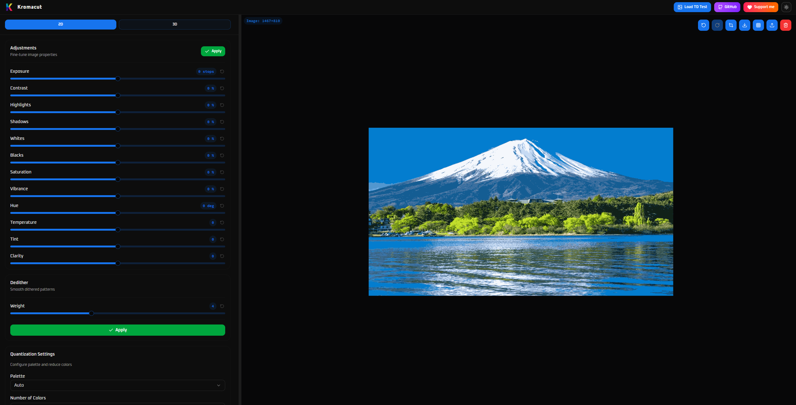
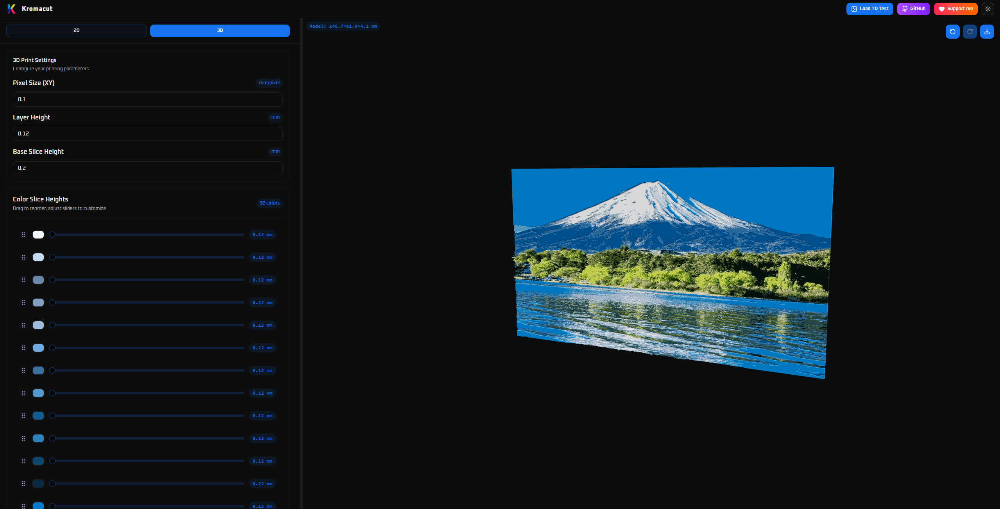
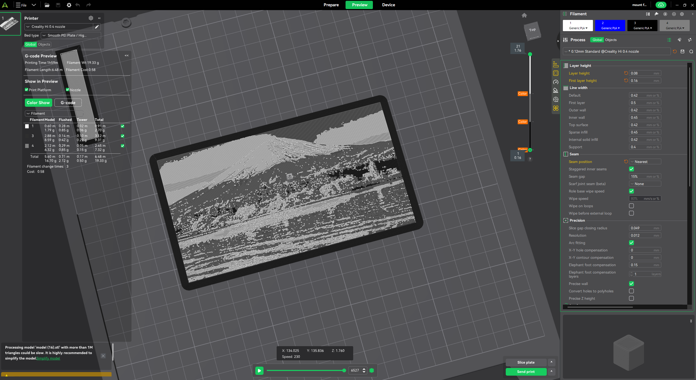
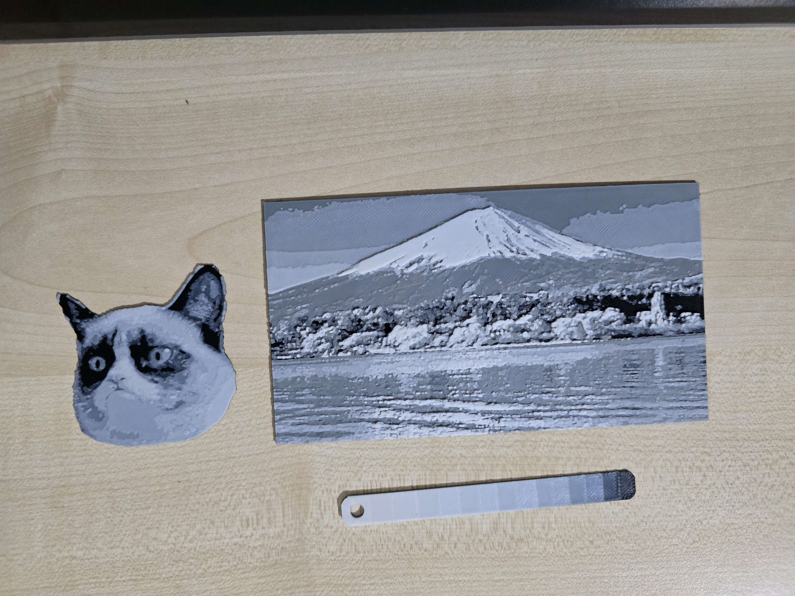

# Kromacut

  

Open-source HueForge-style tool for converting images into stacked, color-layered 3D prints.

Kromacut is a browser-first app that helps you reduce an image to a small palette, preview how the image maps to stacked layers, tweak per-color layer heights and ordering, and export a printable STL along with printer swap instructions.

## Examples

A quick look at what Kromacut produces from a source image to a printable model:

- Fuji test image (2D input) → 3D preview → per-color sliced view → real print

| 2D Input | 3D Preview |
|---|---|
|  |  |
| Sliced by Colors | Real Print |
|  |  |

Another minimal test you can try yourself in the app header: the Transmission Distance (TD) test image.

| TD Test |
|---|
|  |

## Notable Features

- Image upload and preview (drag & drop or file picker).
- Color reduction / quantization with selectable color count.
- Inline color pickers to tweak or replace generated palette colors.
- Per-color slice heights and a configurable base slice height.
- Reorder colors with drag-and-drop to control stack order (darkest → lightest default ordering).
- Live 2D preview and a 3D stacked preview rendered with three.js.
- 3D model export to binary STL or 3MF (Preview) suitable for multi-material slicers.
- Plain-text 3D print instructions that describe layer heights and exact layers where filament swaps are required.
- Copy-to-clipboard button for the print instructions (produces a clean, copyable plain-text plan).

## Notable implementation details

- Frontend: React + TypeScript + Vite.
- 3D Rendering: three.js with BufferGeometry. The geometry pipeline produces per-face (non-indexed) triangles so each color slice renders as a solid block (no blended vertex colors) and vertical side walls are preserved.
- Texture sampling: we create a `CanvasTexture` from the preview canvas and use `NearestFilter` with mipmaps disabled so the texture stays crisp when mapped onto the 3D mesh. The texture UVs are adjusted (repeat/offset) so the canvas region aligns with the mesh bounding box.
- Color ordering: palette swatches are derived from image pixels, then ordered by hue/saturation/lightness and presented from darkest to lightest by default (you can reorder manually).

## How to use

- Upload or drag an image into the preview area.
- Adjust quantization settings to reduce to the desired number of colors.
- Tweak or replace swatches using the color pickers in the Swatches panel.
- Open the 3D panel to configure per-color slice heights, base slice height, pixel size, and the color order.
- When ready, click `Download STL` or `Download 3MF` (in the preview-actions bar when in 3D mode) to export your model.
- Use the `Copy` button in the 3D controls to copy a plain-text print plan that lists layer heights and swap layers (hex codes are followed by friendly color names where available).

## 3D / printing specifics and tips

- Base slice height default: `0.20 mm`
- Layer height default: `0.12 mm`
- Layer height used to compute the exact layer numbers at which color swaps happen in the plain-text plan. 
- Per-color slice heights are snapped/multiplied to sensible values relative to `layerHeight` when the swatches change or are initialized.

## 3MF Export (Preview)

Kromacut now supports exporting directly to `.3mf` format. This file format preserves color information by splitting the model into separate objects for each color, automatically assigned to different extruders/filaments.

**Disclaimer:** This feature is currently in **PREVIEW**. While Kromacut preserves colors, the rest of the settings in the slicer profile should be manually adjusted. Please report any issues or weird behaviors you encounter on the GitHub Issues page.

## Transmission Distance (TD) — what it is and how to use it here

Transmission Distance (TD) is the concept HueForge uses to produce perceptual intermediate shades by stacking translucent filament layers: instead of relying purely on opaque color pigments, TD models how light transmits through thin layers of filament and how stacking different colors (and varying thickness) produces new perceived colors. HueForge does a lot of this work automatically for you (generating intermediate shades and mapping them to layer swaps). For a full conceptual description see the HueForge blog: https://shop.thehueforge.com/blogs/news/what-is-hueforge

Important notes about Transmission Distance in Kromacut:

- Kromacut does NOT compute Transmission Distance or blend shades automatically. All TD-like effects are done manually by you in the app.
- Recommended workflow when you want TD-style results:
	1. Reduce your image to a palette with *more colors* than you actually intend to print. The extra colors give you candidate shades to use as intermediate/translucent-looking layers.
	2. Use the per-color slice heights and ordering controls in the 3D panel to approximate the stacked thicknesses and ordering that would produce the target intermediate shades. Small adjustments to `base slice height`, per-color slice heights, and `layerHeight` change the produced layer numbers and perceived blends.
	3. Iterate with actual filament on a small test print: translucency and perceived mix depend heavily on filament brand, color, and print settings.

All of the automated Transmission Distance processing that HueForge performs is manual in Kromacut — you are given the building blocks (palette, per-color heights, order, and the 3D preview) and you experiment until you find a stack that gives the visual result you want.

TD test image and quick experiment

- This repository includes a small test image `tdTest.png` (found in `src/assets/tdTest.png`).
- The app header includes a `Load TD Test` button that will load that image into the preview so you can quickly experiment with layer ordering and per-color slice heights.

You can try a quick experiment:

1. Click `Load TD Test` in the app header.
2. Reduce colors to your desired number.
3. Generate and download your 3d model. 
4. Follow the layer color swap instructions and print your 3d model to see results.  

Preview of the included TD test image:

## Star History

## Contributing

Contributions welcome. Open issues or PRs for bugs, improvements, or feature suggestions. If you plan a larger change (architecture, algorithms), open an issue first describing the approach so we can discuss it.

## License

This project is open-source — see the `LICENSE` file in the repository.
